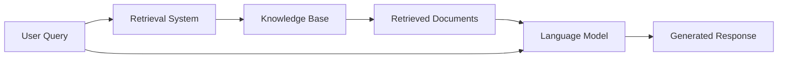

# 🚀 Advance RAG (Retrieval-Augmented Generation)

[](https://awesome.re)
[]()
[]()
[](CONTRIBUTING.md)
[](LICENSE)

> A curated list of awesome **Retrieval-Augmented Generation (RAG)** frameworks, libraries, techniques, and resources. RAG enhances Large Language Models by retrieving relevant information from external knowledge sources to generate more accurate and contextual responses.

## 📖 Table of Contents

- [📝 What is RAG?](#-what-is-rag)
- [🏗️ RAG Approaches](#️-rag-approaches)
- [🛠️ Frameworks](#️-frameworks)
- [⚙️ Techniques](#️-techniques)
  - [🧹 Data Preparation](#-data-preparation)
  - [💬 Prompting](#-prompting)
  - [📄 Chunking](#-chunking)
  - [🔍 Embeddings](#-embeddings)
  - [🎯 Retrieval](#-retrieval)
  - [✅ Response Quality & Safety](#-response-quality--safety)
- [📊 Evaluation Metrics](#-evaluation-metrics)
- [💾 Databases](#-databases)
- [📚 Research Papers](#-research-papers)
- [🎓 Learning Resources](#-learning-resources)
- [🔧 Implementation Examples](#-implementation-examples)
- [🤝 Contributing](#-contributing)
- [📄 License](#-license)

---

## 📝 What is RAG?

**Retrieval-Augmented Generation (RAG)** is a technique that combines retrieval systems with generative language models. The process involves:

1. **📤 Query Processing**: Convert user questions into searchable format
2. **🔍 Information Retrieval**: Search relevant documents from knowledge base
3. **📝 Context Augmentation**: Combine retrieved information with the original query
4. **🧠 Response Generation**: Generate contextual answers using the augmented prompt

### 🔄 Basic RAG Pipeline



---

## 🏗️ RAG Approaches

### 🎯 **Basic RAG Patterns**

#### **Naive RAG** 📝
- **Description**: Simple document chunking → vector similarity → response generation
- **Use Cases**: FAQs, simple Q&A, documentation search
- **Pros**: Easy implementation, fast processing
- **Cons**: May retrieve irrelevant chunks, limited context awareness

#### **Advanced RAG** 🧠
- **Description**: Enhanced with query rewriting, result reranking, and context optimization
- **Use Cases**: Complex queries, enterprise knowledge management
- **Pros**: Better accuracy, improved relevance
- **Cons**: Higher computational cost

#### **Modular RAG** 🔧
- **Description**: Flexible architecture with interchangeable components
- **Use Cases**: Custom workflows, experimental setups
- **Pros**: Highly customizable, easier debugging
- **Cons**: Complex setup, requires expertise

### 🚀 **Specialized RAG Variants**

#### **Multimodal RAG** 🖼️
- **Description**: Processes text, images, audio, and video content
- **Frameworks**: LangChain, LlamaIndex, Haystack
- **Use Cases**: Medical imaging, e-commerce, educational content
- **Key Papers**: [CLIP](https://arxiv.org/abs/2103.00020), [BLIP](https://arxiv.org/abs/2201.12086)

#### **Graph RAG** 🕸️
- **Description**: Uses knowledge graphs for relationship-aware retrieval
- **Tools**: Neo4j, NetworkX, DGL
- **Use Cases**: Scientific research, biomedical data, legal documents
- **Key Papers**: [GraphRAG](https://arxiv.org/abs/2404.16130)

#### **Agentic RAG** 🤖
- **Description**: Autonomous agents that decide when and what to retrieve
- **Types**:
  - **Router-based**: Routes queries to specialized retrievers
  - **Multi-agent**: Parallel agents with result synthesis
- **Use Cases**: Complex reasoning, multi-domain queries
- **Tools**: LangGraph, CrewAI, AutoGen

#### **Hybrid RAG** ⚡
- **Description**: Combines vector search with graph-based retrieval
- **Use Cases**: Enterprise knowledge management, comprehensive research
- **Benefits**: Best of both vector similarity and relationship context

---

## 🛠️ Frameworks

### 🌟 **Popular RAG Frameworks**

| Framework | Description | Language | Key Features |
|-----------|-------------|----------|--------------|
| **[LangChain](https://github.com/langchain-ai/langchain)** | Comprehensive LLM application framework | Python/JS | Chains, agents, memory, extensive integrations |
| **[LlamaIndex](https://github.com/run-llama/llama_index)** | Data framework for LLM applications | Python | Advanced indexing, query engines, evaluation tools |
| **[Haystack](https://github.com/deepset-ai/haystack)** | End-to-end NLP framework | Python | Production-ready, Docker support, evaluation |
| **[ChromaDB](https://github.com/chroma-core/chroma)** | Embedded vector database | Python/JS | Easy integration, fast similarity search |
| **[Pinecone](https://www.pinecone.io/)** | Managed vector database | API | Scalable, real-time updates, high performance |
| **[Weaviate](https://github.com/weaviate/weaviate)** | Vector search engine | GraphQL | Multi-modal, real-time, cloud-native |
| **[Qdrant](https://github.com/qdrant/qdrant)** | Vector similarity search engine | Rust/Python | Fast, scalable, filtering capabilities |
| **[Milvus](https://github.com/milvus-io/milvus)** | Cloud-native vector database | Go | Distributed, GPU acceleration, enterprise-grade |

### 🚀 **Emerging Frameworks**

- **[Verba](https://github.com/weaviate/Verba)** - Golden RAG for Weaviate
- **[PrivateGPT](https://github.com/imartinez/privateGPT)** - Private RAG with local models
- **[RAGFlow](https://github.com/infiniflow/ragflow)** - Visual RAG workflow builder
- **[AnythingLLM](https://github.com/Mintplex-Labs/anything-llm)** - Full-stack RAG application
- **[Dify](https://github.com/langgenius/dify)** - LLMOps platform with RAG

---

## ⚙️ Techniques

### 🧹 Data Preparation

#### **Document Processing**
- **PDF Processing**: [PyPDF2](https://github.com/py-pdf/PyPDF2), [pdfplumber](https://github.com/jsvine/pdfplumber), [Unstructured](https://github.com/Unstructured-IO/unstructured)
- **OCR**: [Tesseract](https://github.com/tesseract-ocr/tesseract), [EasyOCR](https://github.com/JaidedAI/EasyOCR), [PaddleOCR](https://github.com/PaddlePaddle/PaddleOCR)
- **Web Scraping**: [Beautiful Soup](https://www.crummy.com/software/BeautifulSoup/), [Scrapy](https://github.com/scrapy/scrapy), [Playwright](https://github.com/microsoft/playwright)

#### **Data Cleaning**
- **Text Preprocessing**: Remove special characters, normalize whitespace
- **Language Detection**: [langdetect](https://github.com/Mimino666/langdetect), [fasttext](https://github.com/facebookresearch/fastText)
- **Deduplication**: Content-based and hash-based duplicate removal
- **Quality Filtering**: Remove low-quality, irrelevant, or corrupted content

### 💬 Prompting

#### **Prompt Strategies**
- **Few-shot Prompting**: Provide examples in the prompt for better performance
- **Chain-of-Thought**: Step-by-step reasoning for complex queries
- **Role-based Prompting**: Assign specific roles to the AI assistant
- **Template-based**: Structured prompts with placeholders

#### **Prompt Engineering Tools**
- **[LangSmith](https://smith.langchain.com/)** - Prompt testing and optimization
- **[PromptLayer](https://promptlayer.com/)** - Prompt management and analytics
- **[Weights & Biases Prompts](https://wandb.ai/site/prompts)** - Experiment tracking for prompts

#### **Caching**
- **Semantic Caching**: Cache based on semantic similarity of queries
- **Exact Caching**: Cache exact query matches
- **Tools**: Redis, Momento, GPTCache

### 📄 Chunking

#### **Fixed-size Chunking**
- **Character-based**: Split by character count (e.g., 1000 characters)
- **Token-based**: Split by token count (e.g., 256 tokens)
- **Pros**: Consistent chunk sizes, predictable performance
- **Cons**: May break semantic units

#### **Semantic Chunking**
- **Sentence-based**: Split at sentence boundaries
- **Paragraph-based**: Maintain paragraph integrity
- **Topic-based**: Split when topics change
- **Tools**: [spaCy](https://spacy.io/), [NLTK](https://www.nltk.org/), [LangChain Text Splitters](https://python.langchain.com/docs/modules/data_connection/document_transformers/)

#### **Recursive Chunking**
- **Hierarchical**: Split large chunks into smaller ones recursively
- **Adaptive**: Adjust chunk size based on content type
- **Context-aware**: Preserve important context across chunks

#### **Document-based Chunking**
- **Section-based**: Split by document sections/headers
- **Page-based**: One chunk per page
- **Slide-based**: For presentations
- **Table-aware**: Handle tables as units

### 🔍 Embeddings

#### **Text Embedding Models**

| Model | Description | Dimensions | Use Case |
|-------|-------------|------------|----------|
| **OpenAI Ada v2** | General-purpose embedding | 1536 | Production RAG systems |
| **Sentence-BERT** | Semantic sentence embeddings | 384-1024 | Open-source alternative |
| **BGE-Large** | BAAI general embedding | 1024 | Multilingual support |
| **E5-Large** | Microsoft text embedding | 1024 | Strong retrieval performance |
| **all-MiniLM-L6-v2** | Lightweight model | 384 | Fast inference, edge deployment |

#### **Specialized Embeddings**
- **Code Embeddings**: [CodeBERT](https://github.com/microsoft/CodeBERT), [GraphCodeBERT](https://github.com/microsoft/CodeBERT)
- **Multi-language**: [LaBSE](https://github.com/google-research/language), [mBERT](https://github.com/google-research/bert)
- **Domain-specific**: BioBERT (medical), FinBERT (finance), SciBERT (scientific)

#### **Embedding Techniques**
- **Dense Retrieval**: Vector similarity search
- **Sparse Retrieval**: BM25, TF-IDF
- **Hybrid Retrieval**: Combine dense + sparse methods
- **Fine-tuning**: Adapt embeddings for specific domains

### 🎯 Retrieval

#### **Search Strategies**
- **Similarity Search**: Vector cosine similarity, euclidean distance
- **Hybrid Search**: Combine semantic and keyword search
- **Multi-vector**: Different embeddings for different content aspects
- **Hypothetical Document Embeddings (HyDE)**: Generate hypothetical answers first

#### **Retrieval Optimization**
- **Query Expansion**: Add related terms to improve recall
- **Query Rewriting**: Rephrase queries for better retrieval
- **Re-ranking**: Re-order results with cross-encoders
- **Fusion**: Combine multiple retrieval strategies

#### **Advanced Retrieval**
- **Contextual Retrieval**: Use conversation history for better results
- **Time-aware**: Consider temporal relevance
- **Personalization**: Adapt to user preferences and history
- **Multi-hop**: Follow references and citations

### ✅ Response Quality & Safety

#### **Quality Assessment**
- **Relevance Scoring**: How well retrieved documents answer the query
- **Faithfulness**: Whether the response is grounded in retrieved content
- **Completeness**: Whether all aspects of the query are addressed
- **Coherence**: Logical flow and readability of the response

#### **Safety & Bias**
- **Content Filtering**: Remove harmful or inappropriate content
- **Bias Detection**: Identify and mitigate biased responses
- **Hallucination Detection**: Check for factual accuracy
- **Privacy Protection**: Ensure no sensitive information leakage

#### **Evaluation Tools**
- **[RAGAS](https://github.com/explodinggradients/ragas)** - RAG evaluation framework
- **[TruLens](https://github.com/truera/trulens)** - LLM evaluation and tracking
- **[DeepEval](https://github.com/confident-ai/deepeval)** - LLM evaluation framework
- **[LangSmith](https://smith.langchain.com/)** - LLM application development platform

---

## 📊 Evaluation Metrics

### 🔍 Retrieval Metrics

#### **Search Quality**
- **Precision@K**: Fraction of relevant documents in top K results
- **Recall@K**: Fraction of relevant documents retrieved in top K
- **Mean Reciprocal Rank (MRR)**: Average reciprocal rank of first relevant result
- **Normalized Discounted Cumulative Gain (NDCG)**: Ranked retrieval quality measure

#### **Efficiency Metrics**
- **Query Latency**: Time to retrieve relevant documents
- **Index Size**: Memory footprint of the search index
- **Throughput**: Queries processed per second

### 🎯 Generation Metrics

#### **Answer Quality**
- **BLEU**: N-gram overlap between generated and reference answers
- **ROUGE**: Recall-oriented overlap metrics
- **BERTScore**: Semantic similarity using BERT embeddings
- **Human Evaluation**: Manual assessment of answer quality

#### **RAG-specific Metrics**
- **Faithfulness**: Response grounded in retrieved documents
- **Answer Relevancy**: How well the answer addresses the query
- **Context Relevancy**: Quality of retrieved context
- **Context Recall**: Coverage of ground truth in retrieved context

#### **Evaluation Frameworks**
- **[RAGAS](https://github.com/explodinggradients/ragas)** - Comprehensive RAG evaluation
- **[ARES](https://github.com/stanford-futuredata/ARES)** - Automated RAG evaluation
- **[RAGChecker](https://github.com/amazon-science/RAGChecker)** - Fine-grained RAG evaluation

---

## 💾 Databases

### 🗄️ Vector Databases

#### **Cloud-Native**
- **[Pinecone](https://www.pinecone.io/)** - Managed vector database service
- **[Weaviate Cloud](https://weaviate.io/)** - GraphQL vector search
- **[Qdrant Cloud](https://qdrant.io/)** - Fast similarity search
- **[Zilliz](https://zilliz.com/)** - Managed Milvus service

#### **Self-Hosted**
- **[ChromaDB](https://github.com/chroma-core/chroma)** - Embedded vector database
- **[Milvus](https://github.com/milvus-io/milvus)** - Scalable vector database
- **[Qdrant](https://github.com/qdrant/qdrant)** - Rust-based vector engine
- **[Weaviate](https://github.com/weaviate/weaviate)** - Open-source vector search

#### **Traditional + Vector Extensions**
- **[pgvector](https://github.com/pgvector/pgvector)** - PostgreSQL vector extension
- **[Redis Search](https://redis.io/docs/stack/search/)** - Redis with vector search
- **[Elasticsearch](https://www.elastic.co/)** - Search engine with vector support
- **[OpenSearch](https://opensearch.org/)** - Open-source Elasticsearch alternative

### 🌐 Graph Databases

- **[Neo4j](https://neo4j.com/)** - Native graph database
- **[Amazon Neptune](https://aws.amazon.com/neptune/)** - Managed graph database
- **[ArangoDB](https://www.arangodb.com/)** - Multi-model database
- **[TigerGraph](https://www.tigergraph.com/)** - Scalable graph platform

### 🔧 Database Tools

- **[LangChain Vector Stores](https://python.langchain.com/docs/modules/data_connection/vectorstores/)** - Unified vector store interface
- **[LlamaIndex](https://docs.llamaindex.ai/en/stable/module_guides/storing/vector_stores.html)** - Vector store integrations
- **[Haystack Document Stores](https://docs.haystack.deepset.ai/docs/document_store)** - Document storage backends

---

## 📚 Research Papers

### 🎓 Foundational Papers

- **[Retrieval-Augmented Generation for Knowledge-Intensive NLP Tasks](https://arxiv.org/abs/2005.11401)** (2020) - Original RAG paper
- **[Dense Passage Retrieval for Open-Domain Question Answering](https://arxiv.org/abs/2004.04906)** (2020) - DPR
- **[Realm: Retrieval-Augmented Language Model Pre-Training](https://arxiv.org/abs/2002.08909)** (2020) - REALM

### 🚀 Recent Advances

#### **Retrieval Improvements**
- **[Lost in the Middle](https://arxiv.org/abs/2307.03172)** (2023) - Context length and performance
- **[Query2doc](https://arxiv.org/abs/2303.07678)** (2023) - Query expansion with LLMs
- **[HyDE: Precise Zero-Shot Dense Retrieval](https://arxiv.org/abs/2212.10496)** (2022) - Hypothetical document embeddings

#### **RAG Architectures**
- **[Self-RAG](https://arxiv.org/abs/2310.11511)** (2023) - Self-reflective retrieval
- **[FLARE](https://arxiv.org/abs/2305.06983)** (2023) - Forward-looking active retrieval
- **[IRCoT](https://arxiv.org/abs/2212.10509)** (2022) - Interleaving retrieval with chain-of-thought

#### **Multimodal RAG**
- **[CLIP](https://arxiv.org/abs/2103.00020)** (2021) - Vision-language understanding
- **[BLIP-2](https://arxiv.org/abs/2301.12597)** (2023) - Bootstrapped vision-language pre-training
- **[MM-RAG](https://arxiv.org/abs/2407.16241)** (2024) - Multimodal RAG for long documents

#### **Graph RAG**
- **[GraphRAG](https://arxiv.org/abs/2404.16130)** (2024) - Global reasoning with knowledge graphs
- **[GRAG](https://arxiv.org/abs/2405.16506)** (2024) - Graph-augmented generation
- **[KG-RAG](https://arxiv.org/abs/2311.17330)** (2023) - Knowledge graph enhanced RAG

### 📖 Survey Papers

- **[Retrieval-Augmented Generation: A Survey](https://arxiv.org/abs/2312.10997)** (2023)
- **[A Survey on Retrieval-Augmented Text Generation](https://arxiv.org/abs/2202.01110)** (2022)
- **[Large Language Models for Information Retrieval: A Survey](https://arxiv.org/abs/2308.07107)** (2023)

---

## 🎓 Learning Resources

### 📖 Books

- **"Building LLM Applications"** - Practical guide to LLM app development
- **"Retrieval-Augmented Generation in Practice"** - Real-world RAG implementations
- **"Vector Databases for AI"** - Comprehensive guide to vector search

---

## 🔧 Implementation Examples

This repository contains practical implementations of various RAG techniques:

### 📋 Available Notebooks

1. **[Naive_RAG.ipynb](./Naive_RAG.ipynb)** - Basic RAG implementation
2. **[Re-ranking retrieval.ipynb](./Re-ranking%20retrieval.ipynb)** - Advanced retrieval with reranking
3. **[Multi_modal_RAG.ipynb](./Multi_modal_RAG.ipynb)** - Multimodal content processing
4. **[Graph_RAG.ipynb](./Graph_RAG.ipynb)** - Knowledge graph-based retrieval
5. **[Hybrid_RAG.ipynb](./Hybrid_RAG.ipynb)** - Combined vector and graph approaches
6. **[Agentic_RAG.ipynb](./Agentic_RAG.ipynb)** - Agent-based routing system
7. **[Agentic_RAG_Multi_Agent.ipynb](./Agentic_RAG_Multi_Agent.ipynb)** - Multi-agent coordination

### 🚀 Quick Start

```bash
# Clone the repository
git clone https://github.com/yourusername/awesome-rag.git
cd awesome-rag

# Create virtual environment
python -m venv ragvenv
source ragvenv/bin/activate  # On Windows: ragvenv\Scripts\activate

# Install dependencies
pip install -r requirements.txt

# Launch Jupyter notebooks
jupyter notebook
```

### 📊 Performance Comparison

| Approach | Speed | Accuracy | Complexity | Best Use Case |
|----------|--------|----------|------------|---------------|
| Naive RAG | ⚡⚡⚡⚡⚡ | ⭐⭐⭐ | 🔧 | Simple Q&A |
| Advanced RAG | ⚡⚡⚡⚡ | ⭐⭐⭐⭐ | 🔧🔧 | Customer Support |
| Multimodal RAG | ⚡⚡⚡ | ⭐⭐⭐⭐ | 🔧🔧🔧 | Rich Media |
| Graph RAG | ⚡⚡⚡ | ⭐⭐⭐⭐⭐ | 🔧🔧🔧 | Research |
| Hybrid RAG | ⚡⚡ | ⭐⭐⭐⭐⭐ | 🔧🔧🔧🔧 | Enterprise |
| Multi-Agent RAG | ⚡ | ⭐⭐⭐⭐⭐ | 🔧🔧🔧🔧🔧 | Comprehensive Analysis |

---

